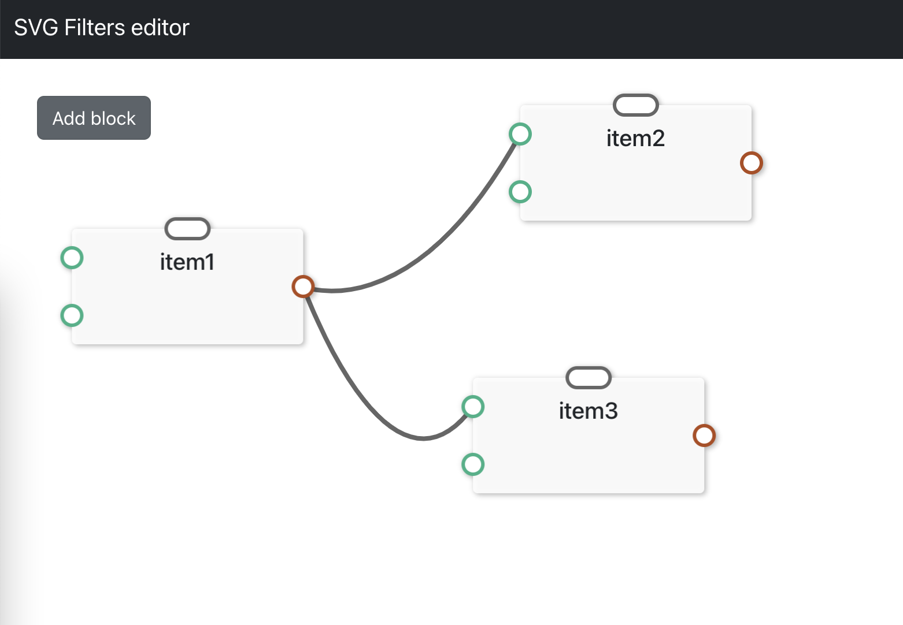

# Visual coding SVG Filter editor ==Work in progress==

## Available Scripts

### `npm start`

Runs the app in the development mode on [http://localhost:3000](http://localhost:3000) to view it in the browser.

### `npm test`

Launches the test runner in the interactive watch mode.

### `npm run build`

Builds the app for production to the `build` folder.
